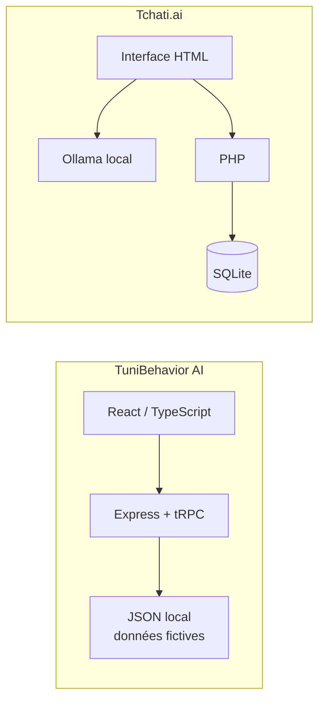
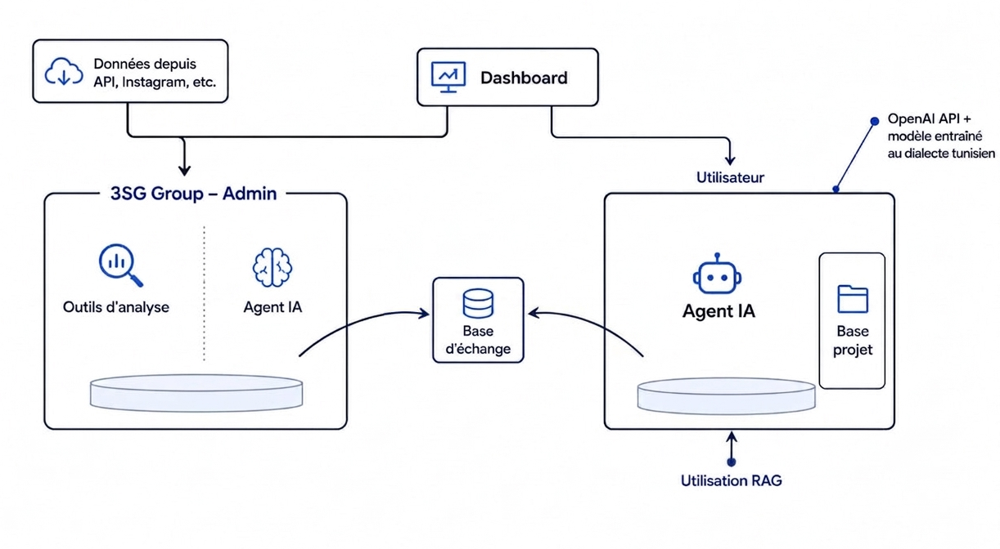
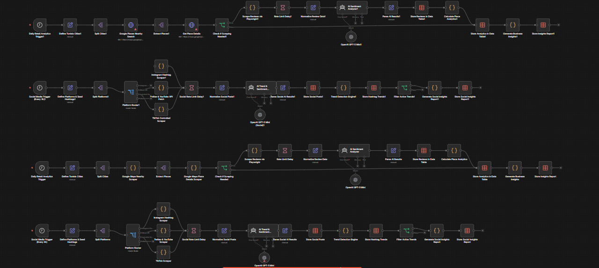
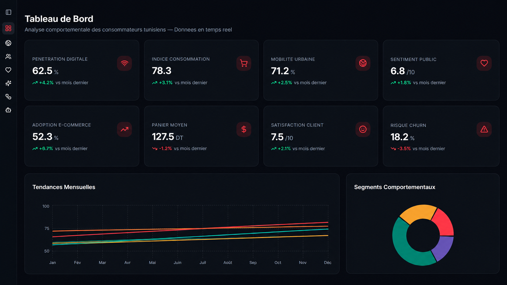
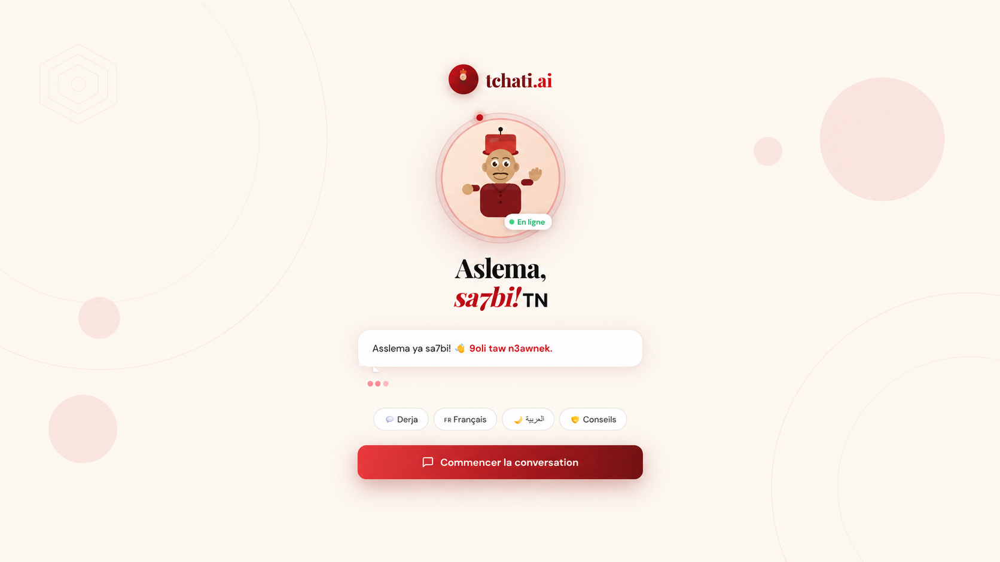
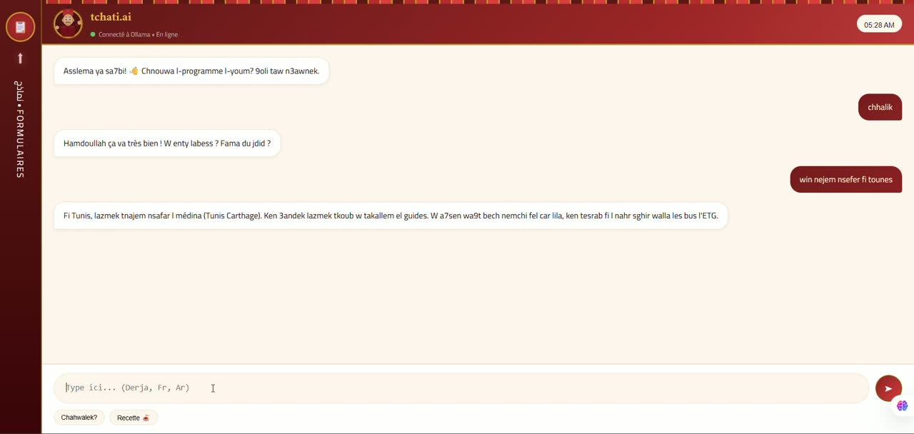
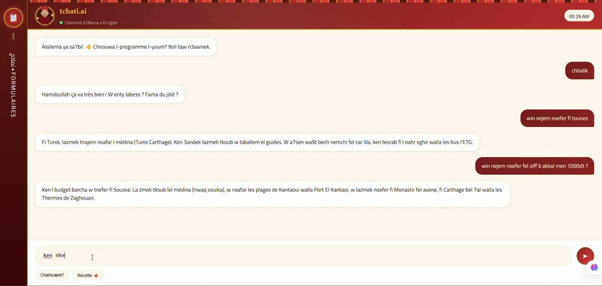
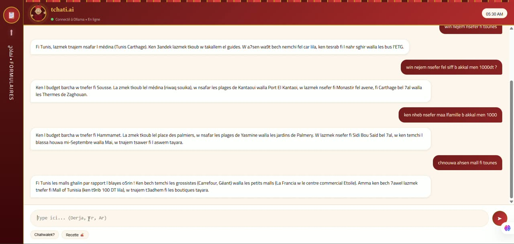

# TuniBehavior AI — agent IA et analyse comportementale

Deux prototypes réalisés pour le hackathon **ENIT Junior Entreprise × 3SG
Group**, dans le cadre d’**Out of the Brief 2026**, les **1er et 2 mai 2026** à
l’**ENIT, Tunis**. Le dépôt réunit un tableau de bord d’analyse et une
démonstration de chatbot en dialecte tunisien.

> Les chiffres du tableau de bord sont des données de démonstration statiques,
> indicatives et non vérifiées. Ils ne constituent ni des résultats d’étude ni
> des données réelles de 3SG Group ou d’un client.

## Problème

Le défi portait sur la compréhension des usages des médias et des comportements
des consommateurs, ainsi que sur l’amélioration des stratégies d’influence et
de communication. L’équipe a exploré comment rendre ces signaux plus lisibles
et proposer des interactions en dialecte tunisien.

## Solution

- **TuniBehavior AI** : interface de tableau de bord avec indicateurs, tendances,
  segmentation, sentiment, carte des gouvernorats et vues de prédiction.
- **Tchati.ai** : interface de conversation en derja, reliée à un modèle Ollama
  local ; l’historique des messages peut être conservé dans SQLite.
- **Questionnaire** : prototype PHP séparé, conservé à titre de référence mais
  incomplet (son schéma de base de données est manquant).

Les deux démonstrations principales sont indépendantes : le chatbot Ollama
n’alimente pas les graphiques du tableau de bord.

## Architecture



Voir [docs/architecture.md](docs/architecture.md) pour les détails et les
limites de chaque flux.

## Technologies

- Tableau de bord : React, TypeScript, Vite, Express, tRPC, Drizzle ORM,
  Tailwind CSS, Recharts et pnpm.
- Chatbot et formulaire : HTML/CSS/JavaScript, PHP, SQLite et API locale
  d’Ollama.
- Les modules de base de données MySQL et d’authentification du tableau de bord
  proviennent du squelette de projet et ne sont pas requis pour consulter les
  données de démonstration.

## Schéma Explicatif



## n8n



## Dashboard



- ▶️ [Voir la démo](https://drive.google.com/file/d/167o1dj0yNZRoeuPz-w7uMQmWDFr18WqY/view?usp=sharing)

## Chatbot









- ▶️ [Voir la démo](https://drive.google.com/file/d/15MvZr0vbj9_iGtKLACmlNMgRUS8zoHD-/view?usp=sharing)

## Présentation

- [Présentation du hackathon (PDF)](presentation/3sg-group-presentation.pdf)

## Installation et exécution

### Tableau de bord

Prérequis : Node.js 20.19 ou plus récent et pnpm 10.4.1.

```powershell
Set-Location src\dashboard
Copy-Item ..\..\.env.example .env
pnpm install --frozen-lockfile
pnpm dev
```

Le serveur affiche l’adresse locale au démarrage (port 3000 par défaut, ou le
prochain port disponible). Les variables d’authentification et de base de
données sont facultatives pour les écrans d’analyse de démonstration. Elles
sont nécessaires uniquement aux modules correspondants du squelette ; sans
`OAUTH_SERVER_URL`, le serveur peut afficher un avertissement OAuth, mais le
tableau de bord reste consultable.

Pour vérifier le projet :

```powershell
pnpm run check
pnpm test
pnpm run build
```

### Chatbot Tchati.ai

Prérequis : PHP avec PDO SQLite et Ollama exécuté en local. Le code appelle
`http://localhost:11434/api/chat` et attend un modèle local nommé
`mon-chatbot` ; aucun modèle ni poids n’est inclus.

```powershell
Set-Location src\chatbot
php -S 127.0.0.1:8000
```

Ouvrir ensuite
[`http://127.0.0.1:8000/chatbot_tounsi_new.html`](http://127.0.0.1:8000/chatbot_tounsi_new.html).
Selon la configuration d’Ollama, il peut être nécessaire d’autoriser l’origine
locale du navigateur. La conversation dépend d’un Ollama et d’un modèle
compatibles.

> Prototype local uniquement : les scripts de stockage/recherche et la page
> d’administration n’ont pas les contrôles d’accès requis pour un déploiement
> public, et l’API PHP autorise les requêtes CORS de toute origine. Ne pas y
> saisir de données personnelles ni l’exposer sur Internet en l’état.

### Formulaire d’enquête

Le flux `form.html` / `submit.php` n’est pas validé : `init_db.php` référence
un schéma SQL absent (`enquete_comportements_achat.sql`). Ne pas l’utiliser
pour collecter des données en l’état.

### Vérifications effectuées

- Tableau de bord : installation verrouillée, vérification TypeScript, test
  Vitest (1 test) et build réussis ; démarrage local et réponse HTTP 200
  vérifiés.
- Chatbot : syntaxe PHP et affichage local de la page vérifiés. La conversation
  Ollama n’a pas pu être testée faute de serveur Ollama disponible.
- Questionnaire : non exécutable tant que le schéma SQL manquant n’est pas
  fourni.

## Équipe

Les noms et rôles ci-dessous sont ceux de la présentation de l’équipe :

- **Mohamed Louai Darguech** — a aidé sur l’ensemble des volets du projet
  (contribution transversale, selon sa propre description).
- **Mohamed Ayedi** — Tech & IA.
- **Saif Edin Hsairi** — Business & Stratégie.

Aucune photo personnelle de l’équipe n’est publiée dans ce dépôt.

## Résultats

Le livrable comprend une démonstration visuelle du tableau de bord et une
interface de chatbot reliée à Ollama. Aucun benchmark, résultat de modèle,
résultat d’enquête ni indicateur de performance vérifié n’est fourni. Les
pourcentages et tendances visibles sont des exemples statiques.

## Limites et améliorations

- Remplacer les données illustratives par des données ouvertes/licenciées et
  documenter leurs sources avant tout usage analytique.
- Remplacer les valeurs de prédiction simulées par un modèle évalué et une
  méthode reproductible.
- Connecter l’assistant du tableau de bord à un service réel si nécessaire ;
  actuellement, ses réponses sont des règles locales.
- Fournir/documenter le modèle Ollama attendu et tester les règles CORS.
- Ajouter le schéma SQL manquant, validation d’entrée et contrôles d’accès au
  prototype d’enquête avant tout déploiement.
- Vérifier et documenter les services externes requis par le squelette
  d’authentification et de stockage.

## Crédits et licences

- Le code conservé, y compris les modules du squelette Manus WebDev, est sous
  [licence MIT](LICENSE), conformément à l’autorisation de republication
  confirmée par le propriétaire du dépôt. Cette licence ne couvre pas les
  marques, la présentation ou les médias.
- Les composants d’interface suivent le modèle de composants
  [shadcn/ui](https://ui.shadcn.com/) ; les dépendances directes sont listées
  dans `src/dashboard/package.json` et verrouillées dans
  `src/dashboard/pnpm-lock.yaml`.
- Licences directes relevées dans les métadonnées des paquets : MIT (React,
  Express, tRPC, Vite, Tailwind CSS, Radix UI, Recharts, Zod et la majorité des
  dépendances), Apache-2.0 (AWS SDK, Drizzle ORM, TypeScript et quelques
  utilitaires), BSD-2-Clause (`dotenv`), ISC (`lucide-react`) et Unlicense
  (`wouter`).
- `@svg-maps/tunisia` est référencé pour le tracé de la carte et attribue la
  géométrie à Simplemaps. Les [conditions Simplemaps](https://simplemaps.com/resources/svg-license)
  autorisent l’usage personnel et commercial dans un projet, mais interdisent
  de redistribuer la carte seule « telle quelle ». Le SVG n’est pas recopié
  dans ce dépôt ; la dépendance est installée séparément.
- Les modules de collecte de logs Manus et le plugin de runtime Manus sans
  licence déclarée ont été exclus de la version préparée. Le code du squelette
  conservé bénéficie d’une autorisation de republication confirmée ; les
  noms/éléments de marque demeurent ceux de leurs propriétaires.
- Les documents officiels de l’organisateur, le lien Drive et les images
  personnelles de l’équipe ne sont pas inclus.
