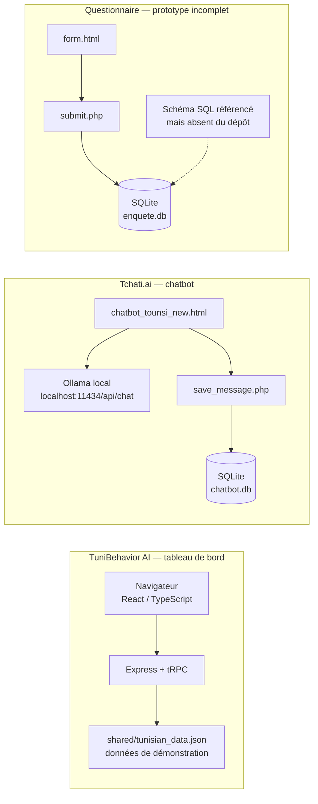

# Architecture

The repository contains two independent demonstrations and an incomplete
questionnaire prototype. They do not share a backend or a live data pipeline.

## Flux et limites

- Le tableau de bord sert les pages d’indicateurs, tendances, segmentation,
  sentiment, géographie et prédictions à partir d’un JSON local. Les données
  sont statiques et illustratives : aucune collecte client ni pipeline temps
  réel n’est livré.
- L’assistant intégré au tableau de bord répond par règles/mots-clés ; ce n’est
  pas l’agent Ollama montré dans la vidéo.
- Le chatbot Tchati.ai appelle un modèle Ollama local configuré sous le nom
  `mon-chatbot` et enregistre les messages dans SQLite. Le modèle n’est pas
  fourni.
- Le formulaire d’enquête et ses scripts PHP sont un prototype distinct. Le
  fichier `init_db.php` référence `enquete_comportements_achat.sql`, absent du
  dépôt ; ce flux n’est donc pas prêt à l’exécution.
- Le code générique d’authentification/stockage du tableau de bord requiert des
  services et des variables d’environnement optionnels, non nécessaires à la
  consultation des données de démonstration.
